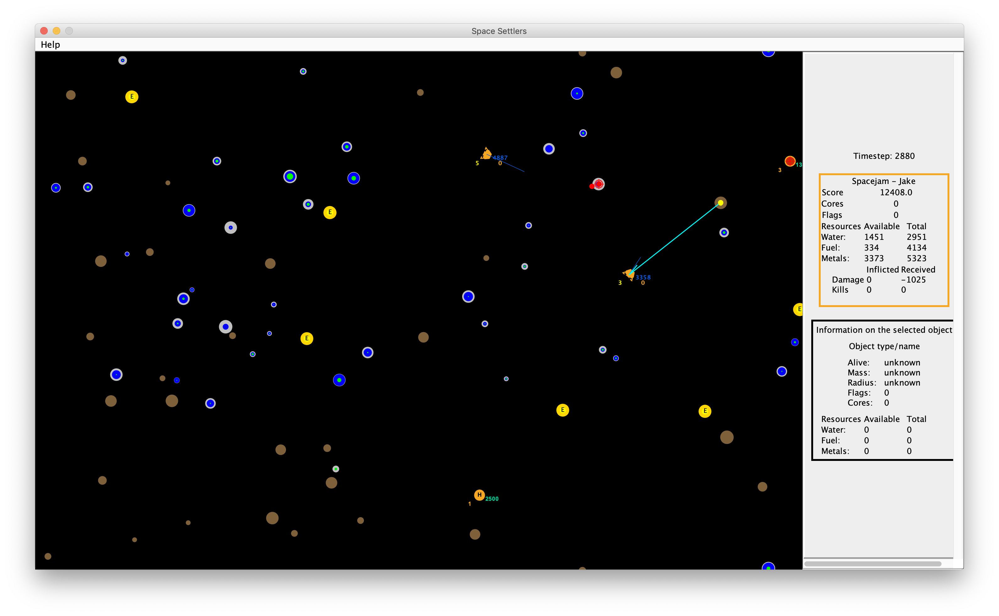
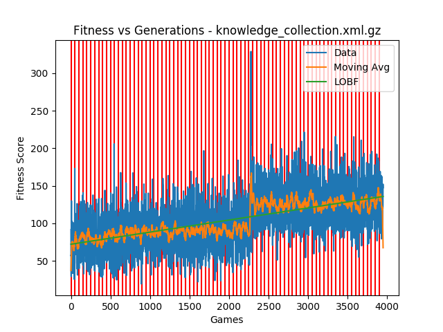

# spacesettlers
Spacewar/Spacesettlers game used by the AI class at the University of Oklahoma

This project stores the source code for the game Space Settlers, formerly known as Spacewar. This game is used to teach Artificial Intelligence at the University of Oklahoma. The game enables students to implement their own search, learning, multi-agent, and planning systems within a complex real-world type environment. They also learn how to use existing software packages. 

### AI
The goal of these games are to have the highest score in the class. The game is limited to 20000 timesteps.  Score is gained by mining resources, and score descreases if your ship hits asteroids. 

Your ship has a finite amount of energy, which gets replenished by going back to your base.

We implemented several techniques to increase our score:
1. Ship determines the 'best' asteroid by assigning scores to each asteroid in the arena. 
This score is a heuristic determined by:
* Distance: Distance between target
- Ship's resources/energy: Cargo value and energy value to choose between bases/beacons
- Asteroids: Finds the cluster of asteroids which have the highest score
- Obstacles: Less likely to head toward object with obstacles between the ship and target

2. Ship predicts where asteroids are moving and intercepts them.

3. Uses a [Genetic algorithm](https://en.wikipedia.org/wiki/Genetic_algorithm) to help the ship avoid asteroids.
Fitness score increases if the ship successfully avoids, and decreases if the ship is unsuccessful.
Obviously some avoidances are better than others, so we give higher fitness score based on:

- Distance to obstacle: The closer the ship is to the obstacle, the harder it is to avoid the obstacle
- Angle to obstacle: The lower the angle is, the harder it is to avoid the obstacle
- Distance to target: The closer the ship is to the target, the harder it is to avoid the obstacle

As you can see the ship shows significant learning over ~80 generations.

4. Implements a decision tree to decide when to fire at other teams' ships based on:
- Angle to enemy ship
- Distance between ships